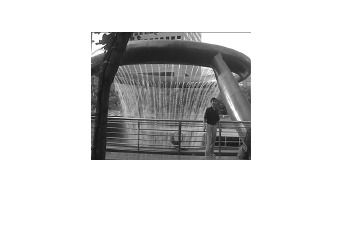
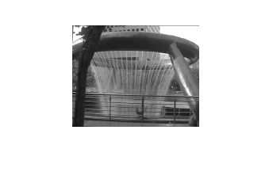
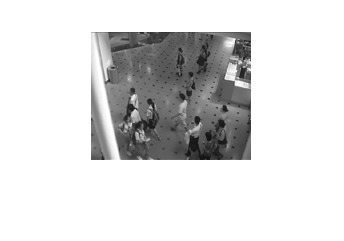
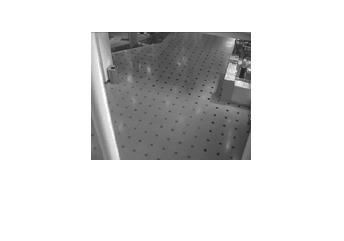
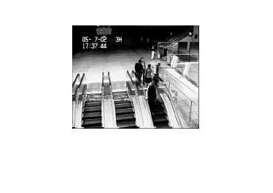
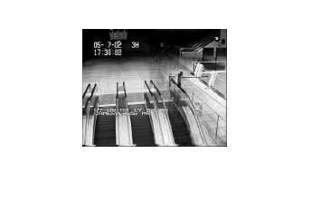

# rPCA-video-background-subtraction
PCA is a statistical technique representing high-dimensional data in a more tracable and low-dimensional form. By using the dependencies between variables, PCA is a way trying to prevent from losing much information. Robust PCA is a robust version of PCA that it explores the following question:
observation: M=L+S  
s.t. rank(L)=r, S is sparse matrix.  
One is expected to recovery the low-rank matrix L from the sparse noise corrupted observation M.  
Robust PCA can be viewed as a robust version of PCA that it allows sparse noise attack. There are quite few methods to solve the problem, such as AccAltProj, AltProj and GD based method. In addition, rPCA can be used to do video background subtraction. In the following, there are some demos.

Original                   |Processed
:-------------------------:|:-------------------------:
 |  
 |  
 |  

I will upload the .m file after the submission of the paper. 
